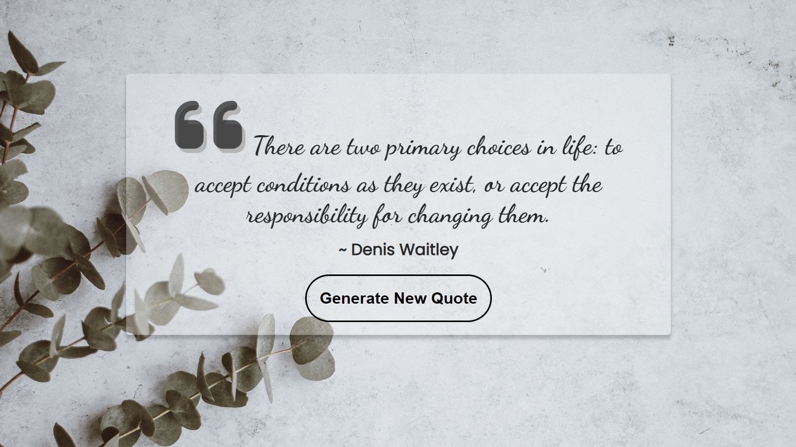

# Random-Quote-Generator-JavaScript-Project

## About

This project is build using Javascript.

## ⚙️ What did I learn by making this project?

- learnt using api(used this api in this project https://type.fit/api/quotes)
- used fetch().
- used async and await.
- used try and catch.

## ⌛ Time taken to finish this project?

This project took me around 2 hour to finish.

## 📷 Screenshots

